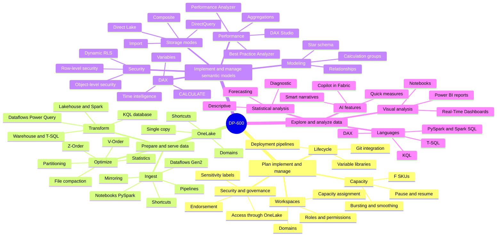
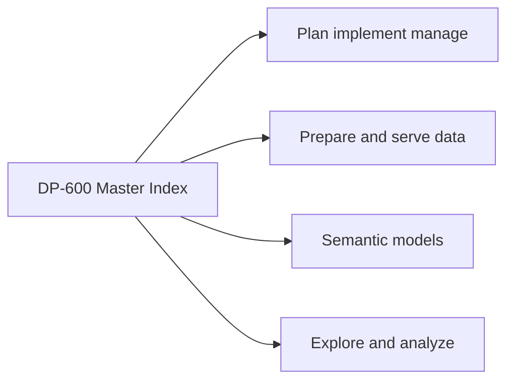
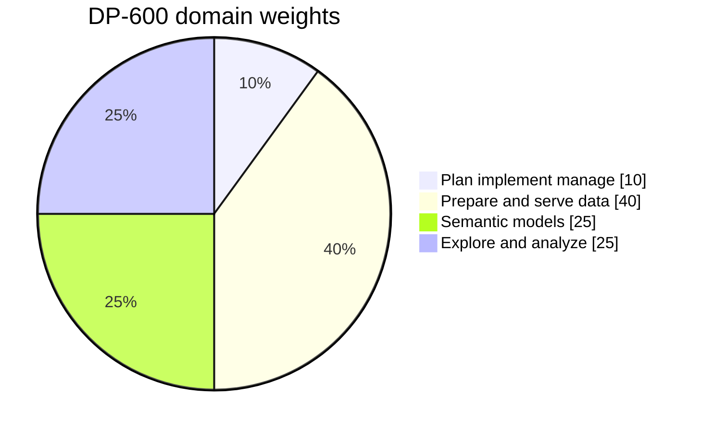

# DP-600 - Implementing Analytics Solutions Using Microsoft Fabric - Visual Study Guide

> Concept-only study aid. No exam questions reproduced. Source PDF (if any) stays local + gitignored.

**Skills outline:** https://learn.microsoft.com/credentials/certifications/resources/study-guides/dp-600

## Master mind map

## Domain map

## Domain weights

## Recommended study order

```mermaid
gantt
    title Suggested study plan
    dateFormat X
    axisFormat Day %d
    section Plan
    Plan implement manage   :t1, 0, 1d
    Prepare and serve data  :t2, after t1, 4d
    Semantic models         :t3, after t2, 3d
    Explore and analyze     :t4, after t3, 2d
    Cheatsheet and review   :t5, after t4, 1d
```

---

**Next:** open [01-plan-implement-manage.md](01-plan-implement-manage.md)
