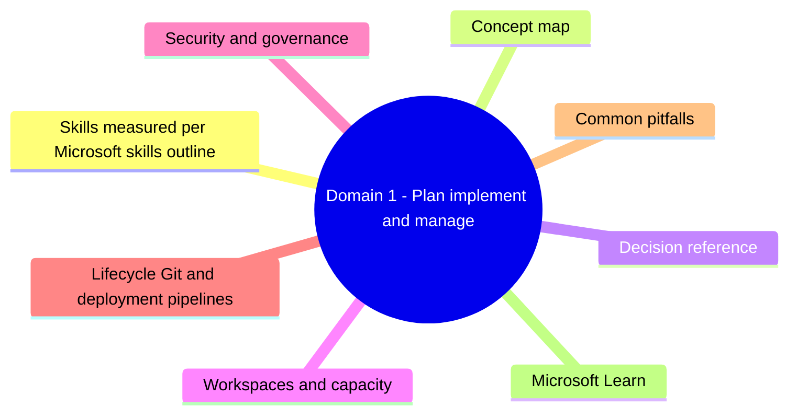
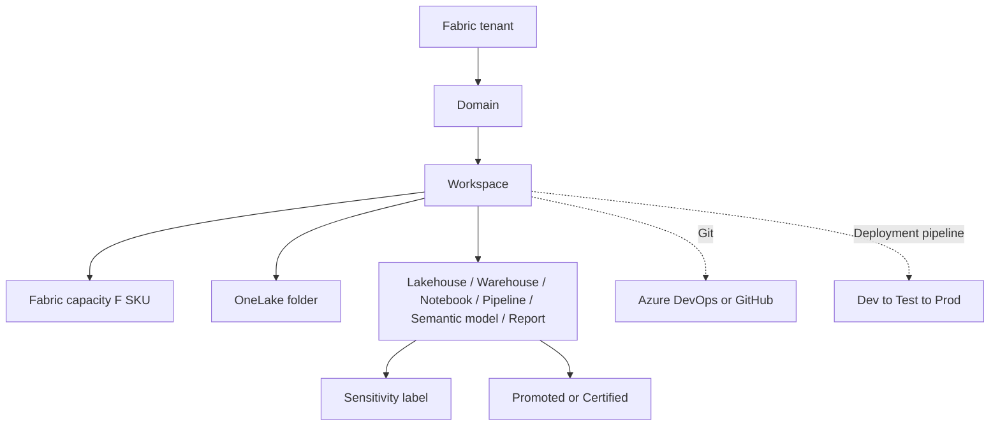

# Domain 1: Plan, Implement, and Manage a Solution for Data Analytics

> The control plane: workspaces, capacity, security, governance, and lifecycle for Microsoft Fabric.

## Domain mind map

## Skills measured (per Microsoft skills outline)

- Plan a data analytics environment (workspaces, domains, capacity).
- Implement and manage a data analytics environment (security, governance, OneLake).
- Manage the analytics development lifecycle (Git, deployment pipelines, variable libraries).

## Concept map

## Decision reference

| Need | Choice | Why |
|---|---|---|
| Group related items for a business unit | Domain | Cross-workspace grouping for governance |
| Isolate dev / test / prod | Separate workspaces + deployment pipeline | Promote artifacts safely |
| Predictable cost, dedicated compute | F SKU capacity | Reserved or pay-as-you-go |
| Pause compute outside business hours | Pause F SKU | No charge while paused (storage still billed) |
| Source-control items as code | Git integration | Branch / PR / merge |
| Promote artifacts dev to prod | Deployment pipeline + variable libraries | Parameterize connections |
| Classify sensitive data | Sensitivity labels (MIP) | Inherits from data sources |
| Mark trusted models | Endorsement: Promoted / Certified | Surface in OneLake catalog |

## Workspaces and capacity

- **Workspace**: container for items (lakehouse, warehouse, notebook, semantic model, report). Assigned to a **capacity**.
- **Workspace roles**: Admin, Member, Contributor, Viewer.
- **Capacity (F SKU)**: F2 to F2048; Capacity Units (CUs) are billable. **Bursting** lets short-running queries exceed CU; **smoothing** averages CU over 24h. Sustained overrun -> throttling, then rejection.
- **Pause / resume**: F SKUs can be paused via Azure portal -> compute charges stop, storage charges continue.
- **Trial**: 60-day F64-equivalent for evaluation.
- **Domain**: tenant-level grouping of workspaces (Sales, Finance) for governance + discoverability.

## Security and governance

- **Workspace roles** apply to all items.
- **Item-level permissions** override workspace roles for sharing.
- **Sensitivity labels** flow with the data through OneLake; required for downstream re-use.
- **Endorsement**: Promoted (any author) or Certified (admin-controlled trusted set).
- **OneLake security**: workspace -> lakehouse -> shortcut. **OneLake data access roles** for finer scoping.
- **Microsoft Purview** integration: scan, classify, lineage.

## Lifecycle - Git and deployment pipelines

- **Git integration**: workspace <-> Azure DevOps repo or GitHub repo. Branch, commit, PR, merge.
- Items are stored as JSON / SQL / .ipynb folders -> diffable.
- **Deployment pipelines**: dev -> test -> prod stages. Compare + deploy items.
- **Variable libraries**: parameter sets per stage (connection strings, paths) -> avoid hard-coded values.
- **Notebooks**: parameterize with `notebookutils` params, reference from Pipelines.

## Common pitfalls

- Assigning all workspaces to one F2 capacity -> throttling + report timeouts.
- No deployment pipeline -> manual copy + risk of drift between dev and prod.
- Sensitivity labels missing on imported sources -> downstream items unlabeled, governance gap.
- Forgetting to pause non-prod F SKUs -> unnecessary CU billing.
- Mixing Pro license workspaces with Fabric items -> Fabric items require capacity assignment.

## Microsoft Learn

- [Microsoft Fabric overview](https://learn.microsoft.com/fabric/fundamentals/microsoft-fabric-overview)
- [Workspaces](https://learn.microsoft.com/fabric/fundamentals/workspaces)
- [Capacities](https://learn.microsoft.com/fabric/enterprise/licenses)
- [Git integration](https://learn.microsoft.com/fabric/cicd/git-integration/intro-to-git-integration)
- [Deployment pipelines](https://learn.microsoft.com/fabric/cicd/deployment-pipelines/intro-to-deployment-pipelines)

---

**Next:** [02-prepare-and-serve-data.md](02-prepare-and-serve-data.md)
