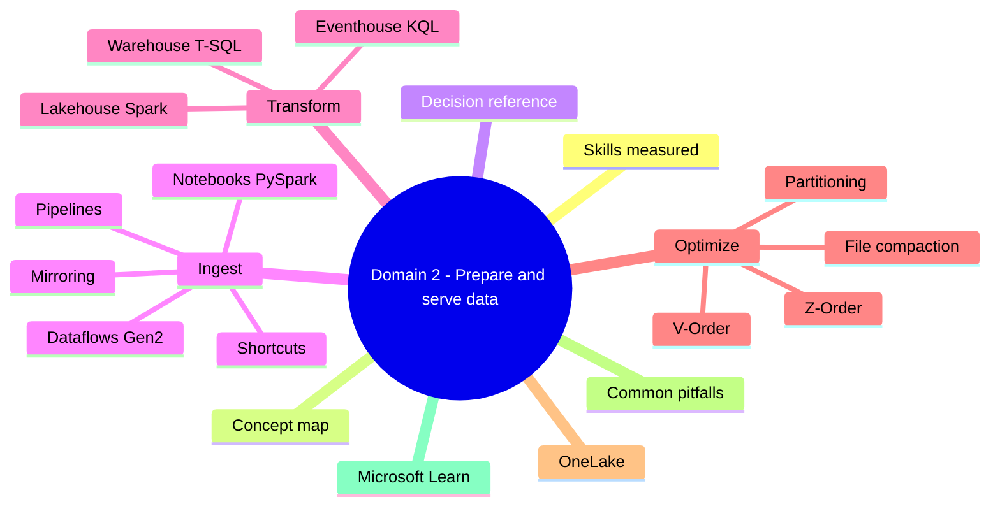
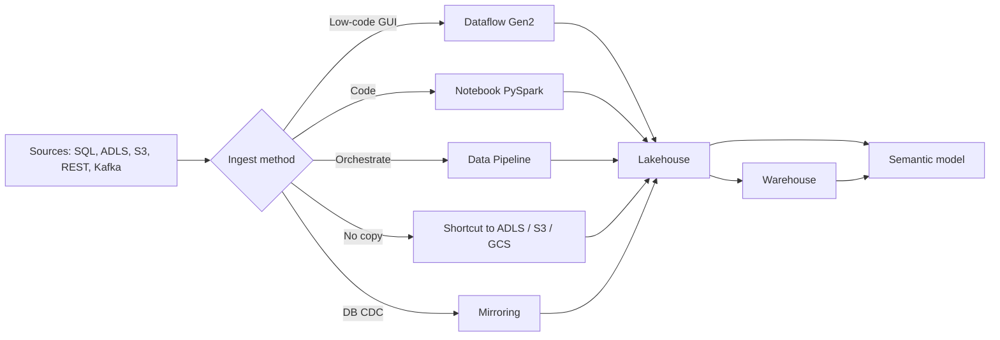

# Domain 2: Prepare and Serve Data

> Largest domain. Ingest, transform, optimize, and serve through OneLake.

## Domain mind map

## Skills measured

- Create and manage shortcuts.
- Implement and manage a Lakehouse, Warehouse, Eventhouse / KQL Database.
- Choose data ingestion patterns; implement medallion architecture.
- Transform and optimize for performance.

## Concept map

## Decision reference

| Need | Choice |
|---|---|
| Many sources, low-code transform, citizen developer | Dataflow Gen2 |
| Custom logic, big data, code | Notebook (PySpark / Spark SQL) |
| Orchestration of multiple steps | Data Pipeline |
| Reference data in ADLS Gen2 / S3 / GCS without copying | OneLake shortcut |
| Continuous replication of operational DB | Mirroring (Azure SQL DB / Cosmos DB / Snowflake) |
| Real-time stream into Eventhouse | Eventstream + KQL Database |
| Tabular SQL workload, T-SQL endpoints | Warehouse |
| Lake-first, mixed schema, file APIs | Lakehouse |
| Time-series + log telemetry | Eventhouse / KQL Database |
| Centralize hot small-file lake | Lakehouse + V-Order + table optimize |

## Ingest patterns

- **Pipelines**: orchestration. Activities: Copy, Notebook, Dataflow, Stored Procedure, Lookup, ForEach, If.
- **Dataflows Gen2**: Power Query Online -> output to Lakehouse / Warehouse / KQL DB / Azure SQL.
- **Notebooks**: PySpark / Spark SQL / Scala / R; bind to Lakehouse default. Use `spark.read` / `df.write.format('delta')`.
- **Shortcuts**: pointer in OneLake to ADLS Gen2, Amazon S3, Google Cloud Storage, internal OneLake folder. **No data movement**.
- **Mirroring**: near-real-time CDC mirror of Azure SQL DB / Cosmos DB / Snowflake into OneLake as Delta. Zero ETL for analytics queries.

## Lakehouse vs Warehouse vs Eventhouse

| Trait | Lakehouse | Warehouse | Eventhouse / KQL DB |
|---|---|---|---|
| Storage | Delta Parquet on OneLake | Delta Parquet on OneLake | KQL columnar on OneLake |
| Compute | Spark + SQL endpoint (read-only) | Distributed T-SQL engine (read/write) | KQL engine |
| Best for | Big data, ML, files + tables | DW workloads, T-SQL ETL, multi-table joins | Time-series, telemetry, logs |
| Multi-table T-SQL transactions | No | Yes | No |
| Schema | Implicit on read | Defined; ACID | Implicit, semi-structured |

## Transform

- **Lakehouse**: Spark notebooks. `df.write.format('delta').mode('overwrite').save(...)`. Optimize with `OPTIMIZE` and `VACUUM`.
- **Warehouse**: T-SQL CTAS, `CREATE TABLE AS SELECT`, stored procedures. Distributed query optimizer.
- **Dataflow Gen2**: Power Query M; staging in OneLake; can chain.
- **Medallion**: Bronze (raw) -> Silver (cleansed) -> Gold (curated for BI).

## Optimize for performance

- **V-Order**: Microsoft-specific Parquet write that reorders for vector + read efficiency. Default on for Fabric writes.
- **Partitioning**: by date / region; avoid high-cardinality columns. Aim for 100 MB - 1 GB files per partition.
- **Z-Order**: cluster within Parquet files on common predicates.
- **OPTIMIZE + VACUUM**: compact small files, clean tombstones.
- **Statistics** (Warehouse): auto-managed but verify after large loads.
- **Avoid small file problem**: combine micro-batches; use `coalesce(N)` before write.

## OneLake essentials

- One logical lake per tenant; physically backed by ADLS Gen2.
- Items live in workspace folders.
- Shortcuts let multiple workspaces reference the same data.
- ADLS Gen2 endpoint: `<tenant>.onelake.dfs.fabric.microsoft.com`.

## Common pitfalls

- Loading raw CSV to Gold without medallion -> ungoverned reporting layer.
- Forgetting OPTIMIZE -> small file problem -> slow queries.
- Partition column with billions of distinct values -> partition explosion.
- Mirroring set up but downstream uses snapshot copy -> defeats zero-ETL goal.
- Using DirectQuery on a non-Direct-Lake-capable source for live reports -> performance hit.
- Granting workspace Admin to data engineers when Contributor is enough.

## Microsoft Learn

- [Lakehouse and Delta Lake](https://learn.microsoft.com/fabric/data-engineering/lakehouse-overview)
- [Warehouse](https://learn.microsoft.com/fabric/data-warehouse/data-warehousing)
- [Data pipelines](https://learn.microsoft.com/fabric/data-factory/data-factory-overview)
- [Dataflows Gen2](https://learn.microsoft.com/fabric/data-factory/dataflows-gen2-overview)
- [OneLake shortcuts](https://learn.microsoft.com/fabric/onelake/onelake-shortcuts)
- [Mirroring](https://learn.microsoft.com/fabric/database/mirrored-database/overview)

---

**Next:** [03-implement-semantic-models.md](03-implement-semantic-models.md)
