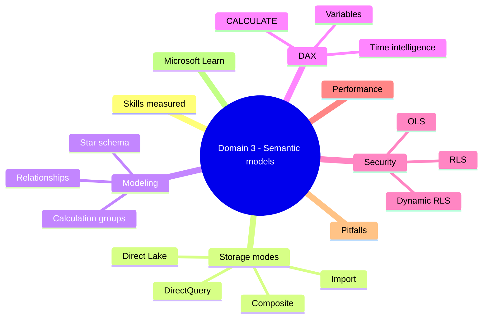
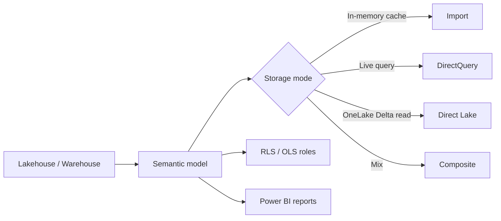

# Domain 3: Implement and Manage Semantic Models

> Power BI semantic models on Fabric: storage modes, DAX, security, performance.

## Domain mind map

## Skills measured

- Design and build a semantic model.
- Implement DAX measures, calculation groups, parameters.
- Optimize enterprise-scale semantic models.
- Implement row-level and object-level security.
- Use endorsement, lineage, and impact analysis.

## Concept map

## Storage modes

| Mode | When to use | Trade-off |
|---|---|---|
| Import | Small/medium datasets, fast aggregation | Refresh windows; size limits per SKU |
| DirectQuery | Real-time over relational source | Query performance depends on source |
| Direct Lake | Large datasets in OneLake Delta tables | Best of both - in-memory speed, no refresh |
| Composite | Mix of imported dims + DirectQuery facts | Complex governance |

## Direct Lake essentials

- Reads Delta Parquet directly from OneLake into VertiPaq engine on demand.
- No scheduled refresh; **framing** updates the model when underlying tables change.
- Falls back to DirectQuery if a query exceeds Direct Lake limits (column count / row group size).
- Tables must be V-Order optimized for best performance.
- Requires Fabric SKU capacity (F SKU, P SKU, or trial).

## Modeling

- **Star schema**: fact + dimensions; avoid snowflakes for performance.
- **Relationships**: 1:many, single-direction by default; bidirectional only when necessary.
- **Calculation groups**: reusable time intelligence + measures; preferred over copy-paste DAX.
- **Field parameters**: dynamic axis / measure switch in visuals.
- **Aggregations**: pre-aggregate at coarser grain to avoid full scan.

## DAX essentials

- `CALCULATE(<measure>, <filters>)`: most powerful function; modifies filter context.
- `FILTER(<table>, <condition>)`: returns table; use sparingly inside CALCULATE.
- Time intelligence: `DATEADD`, `SAMEPERIODLASTYEAR`, `TOTALYTD`, `DATESINPERIOD`. Requires a marked Date table.
- Variables: `VAR x = ...; RETURN ...` for clarity + performance.
- `SUMX` / `AVERAGEX`: row-context iterators.
- Always specify a calendar table; do not rely on auto date.

## Row-Level Security (RLS) and Object-Level Security (OLS)

- **RLS roles**: define DAX filter expression on a table, e.g. `[Region] = USERPRINCIPALNAME()`.
- **Dynamic RLS**: pull mapping from a security table joined by user.
- **OLS**: hide columns or whole tables for specific roles. Defined via tabular editor or XMLA endpoint.
- **Test as role**: required step before publishing.

## Performance optimization

- **Performance Analyzer** (Power BI Desktop): captures DAX, query, render times per visual.
- **DAX Studio**: server timings, query plans.
- **Best Practice Analyzer (BPA)** in Tabular Editor: rule-based audit (e.g., avoid `EARLIER`, prefer measures).
- **Aggregations**: define for large fact tables; semantic model uses agg first.
- **Reduce cardinality**: integer keys vs strings; remove time component from dates.
- **Avoid bidirectional relationships** unless required.

## Common pitfalls

- Bidirectional filters causing ambiguous paths -> model warnings + wrong totals.
- Using auto date hierarchies -> hidden tables bloat model size.
- Calculated columns where measures would do -> unnecessary memory.
- DirectQuery to a slow source without aggregations -> bad UX.
- Direct Lake on un-optimized Delta table -> falls back to DirectQuery silently.
- Forgetting to mark Date table -> time intelligence breaks.

## Microsoft Learn

- [Semantic models in Fabric](https://learn.microsoft.com/fabric/data-warehouse/semantic-models)
- [Direct Lake](https://learn.microsoft.com/fabric/get-started/direct-lake-overview)
- [DAX reference](https://learn.microsoft.com/dax/)
- [Row-level security in Power BI](https://learn.microsoft.com/power-bi/enterprise/service-admin-rls)
- [Performance Analyzer](https://learn.microsoft.com/power-bi/create-reports/desktop-performance-analyzer)

---

**Next:** [04-explore-and-analyze-data.md](04-explore-and-analyze-data.md)
