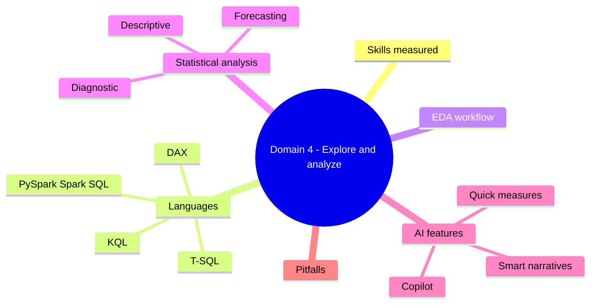
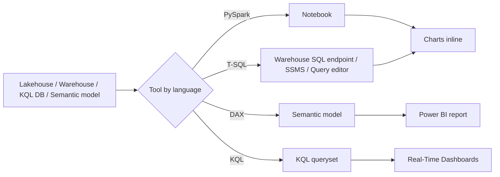

# Domain 4: Explore and Analyze Data

> EDA, descriptive + diagnostic + predictive analysis across DAX, T-SQL, KQL, and PySpark.

## Domain mind map



## Skills measured

- Perform exploratory data analysis (EDA).
- Query data using DAX, T-SQL, PySpark, KQL.
- Apply statistical functions, forecasting, and AI features.

## Concept map



## Languages by use case

| Use case | Language |
|---|---|
| Aggregated business metrics for report | DAX (semantic model) |
| Ad-hoc joins across many warehouse tables | T-SQL |
| Big-data feature engineering | PySpark / Spark SQL |
| Time-series telemetry, log search | KQL |
| File-level exploration in lakehouse | PySpark or notebook SQL |

## Exploratory analysis workflow

1. **Profile**: row counts, null %, distinct values, distribution.
2. **Detect anomalies**: outliers, sudden trend changes.
3. **Aggregate**: by dimension (time, region, product).
4. **Compare**: period-over-period, segment-over-segment.
5. **Visualize**: histograms, box plots, line charts, heat maps.
6. **Hypothesize and test**: drill paths, decomposition.

## Statistical analysis

- **Descriptive**: mean, median, mode, std dev, percentiles, skewness.
- **Diagnostic**: drill-down, decomposition tree, key influencers visual (Power BI), correlation.
- **Forecasting**: built-in Power BI forecast on line charts; ARIMA / Prophet via notebooks; KQL `make-series` + `series_decompose_forecast`.
- **What-if parameters**: model alternative scenarios.
- **A/B testing**: cohort comparison via measures and visuals.

## AI features in Fabric

- **Copilot in Fabric** (preview/GA depending on workload):
  - Copilot in Power BI report -> generate measures, narrative summaries.
  - Copilot in notebooks -> generate code from prompt.
  - Copilot in Data Factory -> generate dataflow steps.
  - Copilot in Real-Time Intelligence -> generate KQL.
- **Quick measures**: GUI to scaffold common DAX patterns.
- **Smart narratives**: auto-generated text summaries.
- **Q&A** (Power BI): natural-language query of semantic model.
- **Decomposition tree** + **Key influencers** visuals.

## Real-Time Intelligence (KQL specific)

- **Eventstream**: ingest from Event Hubs / IoT Hub / Azure Storage.
- **KQL Database** in Eventhouse: queryable in seconds.
- **Real-Time Dashboards**: KQL-driven, streaming refresh.
- **Reflexes**: trigger Power Automate / activator on event conditions.

## KQL essentials

```
TableName
| where Timestamp > ago(1h)
| summarize count() by bin(Timestamp, 5m), Region
| render timechart
```

- `make-series` for time-series.
- `parse_json` for nested JSON.
- `series_decompose_forecast` for built-in forecasting.

## Common pitfalls

- DAX measure that re-evaluates inside an iterator -> O(n^2).
- T-SQL on Warehouse using `SELECT *` on wide tables -> slow scans.
- Notebook attaches to default lakehouse -> writes go to wrong workspace.
- KQL query without time filter -> scans full retention; cost + slow.
- Trusting Copilot output without unit tests -> generated DAX may compile but be wrong.

## Microsoft Learn

- [Real-Time Intelligence](https://learn.microsoft.com/fabric/real-time-intelligence/overview)
- [KQL reference](https://learn.microsoft.com/kusto/query/)
- [Spark in Fabric](https://learn.microsoft.com/fabric/data-engineering/spark-compute)
- [Copilot in Fabric](https://learn.microsoft.com/fabric/get-started/copilot-fabric-overview)

---

**Next:** [05-exam-cheatsheet.md](05-exam-cheatsheet.md)
