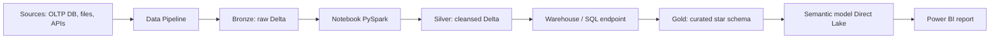
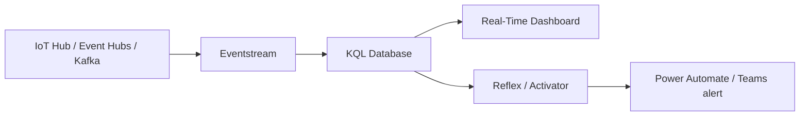
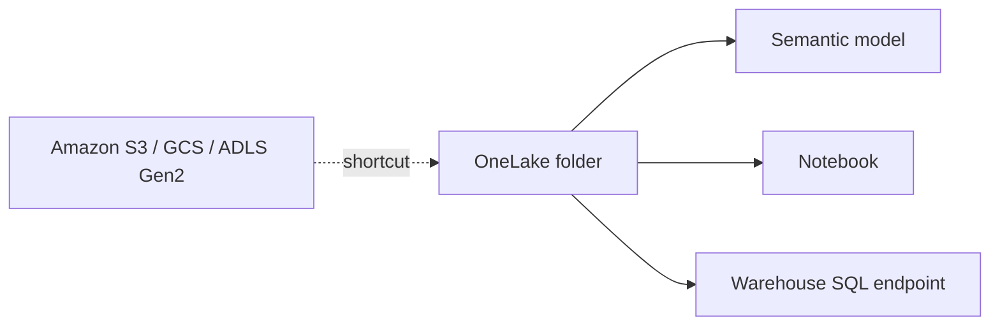
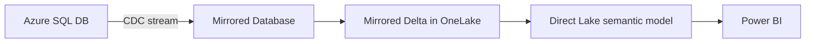
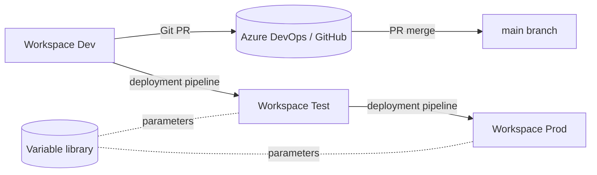

# DP-600 Reference Architectures

> Canonical Fabric analytics patterns. Memorize the shapes.

## 1. Medallion Lakehouse

- Bronze keeps raw landing zone; Silver is conformed; Gold is BI-ready.
- All layers in OneLake -> single lake, multi-engine access.

## 2. Real-Time Intelligence

- Sub-second latency; KQL DB stores hot data with retention policy.
- Reflexes encode "alert when count > X" without code.

## 3. Cross-cloud lake via shortcuts

- Shortcut = pointer; data stays in source. Egress costs stay outside Fabric.
- Works for ADLS Gen2, Amazon S3, Google Cloud Storage, internal OneLake folders.

## 4. Mirroring for zero-ETL analytics

- Azure SQL DB / Cosmos DB / Snowflake mirrored continuously.
- No Spark / pipeline; analytics stays current automatically.

## 5. Lifecycle: Dev -> Test -> Prod

- Variable libraries swap connection strings per stage.
- Git tracks item JSON; deployment pipelines move artifacts.

---

[Master Index](00-MASTER-INDEX.md)
